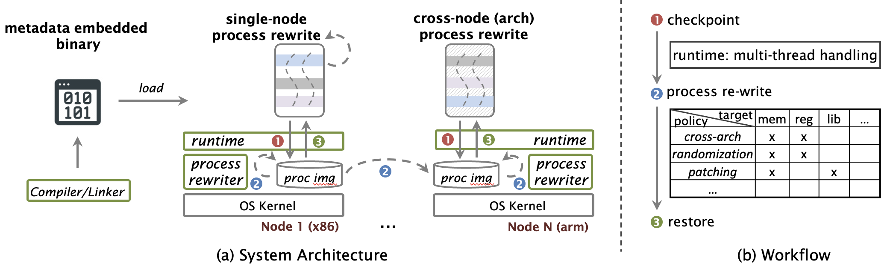

# Dapper: A Lightweight and Extensible Framework for Live Program State Rewriting

Transform live program state (i.e., CRIU images) between different architectures for native binaries.

:rocket: **Quickstart Guide**

You can try `Dapper` on an `x86` server running `Ubuntu 22.04` or later by following the two steps below:

- [Step 1: Setup VMs using Docker (~20 minutes)](https://github.com/dapper-project/dapper/wiki/Environment-Setup#setup-vms-using-docker-recommended-20-minutes)
- [Step 2: Live Migrate a Program Cross Architectures (~20 minutes)](https://github.com/dapper-project/dapper/wiki/Migrate-a-Simple-Program#live-migrate-a-program-cross-architectures-20-minutes)

---

Please refer to our [wiki](https://github.com/dapper-project/dapper/wiki) for a **more detailed tutorial** on rewriting process images with Dapper.
Dapper supports live process migration of natively compiled Linux binaries across servers with CPUs of different architectures.

Dapper was built on top of [CRIU](https://github.com/checkpoint-restore/criu) to dump a running process and then transform the CRIU images to support restoration on servers of a different architecture. Currently, Dapper supports process migration on `x86-64` and `aarch64` CPUs. Dapper uses LLVM's stack maps to generate stack and register metadata and implements a stack and register transformation logic leveraging the generated metadata. It does this on CRIU dumped images and hence does not involve injecting transformation runtime within the binary image improving security.

This repository provides the CRIU wrapper and the compiler toolchain can be found on [this](https://github.com/ssrg-vt/popcorn-compiler/tree/stack_pop) branch of the popcorn compiler repository.
